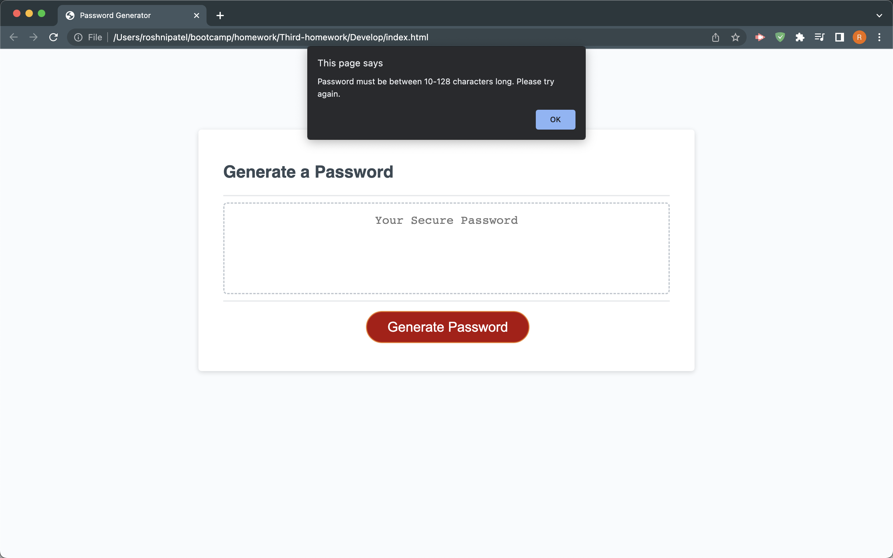

# 03 JavaScript: Password Generator

## My Task 

'''
Start with given code and add functions and variables to make the code work.
When the button is clicked, I need the user to be prompted with questions on how long and the types of characters they want in their password.
If failed, they should be directed to the page once again with same questions being asked.
User gets to choose which characters they want to include and the ones they want to exclude which will be used to generate a unique password for them. 
Once it matches the criteria, the password will be generated and shown.
'''

## Mock Up of my Application's appearance and functionality:

## Link to the Deployed Application

https://roshniipatel.github.io/password-generator-genie/ 
